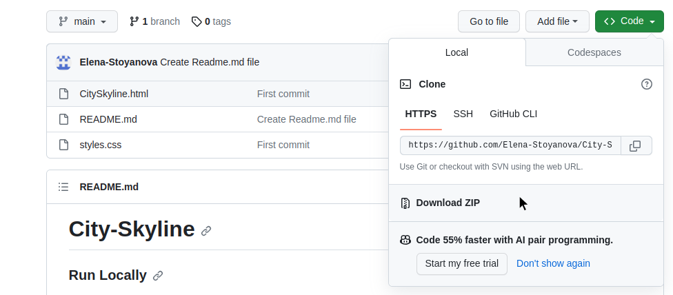

# City Skyline

Made with HTML and CSS.

👉 [City-Skyline](http://htmlpreview.github.io/?https://github.com/Elena-Stoyanova/City-Skyline/blob/main/CitySkyline.html)

### Instructions

- Click the button to switch between day and night.

### Run locally

Click the button <> Code and press Download ZIP.

Then when you save it, double click on HTML file. 
And that's it! 😊
